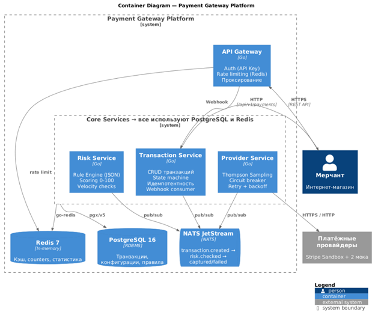
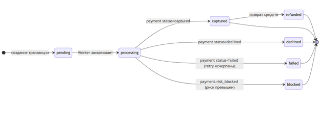
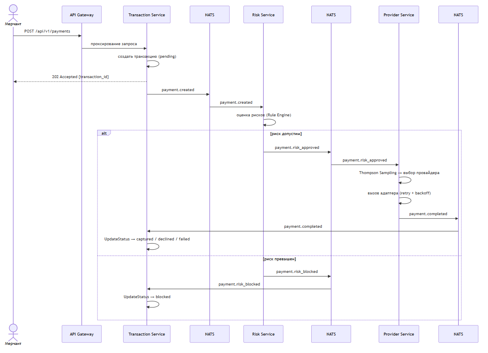
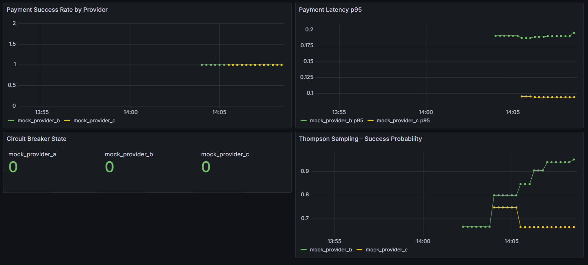

# Payment Gateway Platform

[](https://go.dev/)
[](https://github.com/BuzzLyutic/payment-gateway-microservices/actions/workflows/ci-api-gateway.yml)
[](https://github.com/BuzzLyutic/payment-gateway-microservices/actions/workflows/ci-transaction-service.yml)
[](https://github.com/BuzzLyutic/payment-gateway-microservices/actions/workflows/ci-risk-service.yml)
[](https://github.com/BuzzLyutic/payment-gateway-microservices/actions/workflows/ci-provider-service.yml)
[](LICENSE)
[]()
[](https://nats.io/)
[](https://www.postgresql.org/)
[](https://redis.io/)
[](https://docs.docker.com/compose/)

Микросервисная платформа агрегации платёжных провайдеров с интеллектуальной маршрутизацией на основе алгоритма сэмплирования Томпсона (Thompson Sampling).

Платформа предоставляет единый REST API для приёма платежей и самостоятельно решает, через какого провайдера провести транзакцию - адаптивно, с учётом исторической успешности, латентности и комиссии каждого провайдера.

---

## Содержание

- [Обзор архитектуры](#обзор-архитектуры)
- [Ключевые возможности](#ключевые-возможности)
- [Технологический стек](#технологический-стек)
- [Сервисы](#сервисы)
- [Быстрый старт](#быстрый-старт)
- [API](#api)
- [Поток обработки платежа](#поток-обработки-платежа)
- [Конфигурация](#конфигурация)
- [Тестирование](#тестирование)
- [Мониторинг](#мониторинг)
- [Структура проекта](#структура-проекта)

---

## Обзор архитектуры

Платформа построена по принципам событийно-ориентированной архитектуры (Event-Driven Architecture) и паттерна Saga (Choreography). Четыре независимых микросервиса взаимодействуют через брокер сообщений NATS JetStream, каждый обладает собственным хранилищем данных. Снаружи открыт только один порт — `8080` API Gateway.



### Архитектурные паттерны

| Паттерн | Назначение | Где применяется |
|---|---|---|
| **API Gateway** | Единая точка входа, централизованная аутентификация | `api-gateway` |
| **Saga (Choreography)** | Согласованность данных без распределённых блокировок | NATS JetStream |
| **Circuit Breaker** | Изоляция сбоев провайдеров, предотвращение каскадных отказов | `provider-service` |
| **Thompson Sampling** | Адаптивный выбор провайдера (Multi-Armed Bandit) | `provider-service` |
| **Idempotency Key** | Защита от дублирования платежей при сетевых сбоях | `transaction-service` |
| **Database per Service** | Независимость развёртывания, изоляция данных | PostgreSQL × 2, Redis |
| **Fail-open** | Полная блокировка при сбое вспомогательного сервиса | Risk Service пропускает velocity-проверки при недоступности Redis |

---

## Ключевые возможности

- **Интеллектуальная маршрутизация** — алгоритм Thompson Sampling адаптивно выбирает провайдера с учётом трёх критериев: вероятности успеха, латентности (p95) и комиссии. Балансирует exploration/exploitation без ручной настройки.
- **Оценка рисков** — конфигурируемый движок правил в формате JSON — простые проверки (сумма, время суток) и velocity-проверки (частота транзакций через Redis INCR + TTL). Скоринг 0–100, блокировка при score ≥ 70. Правила изменяются без пересборки образа.
- **Отказоустойчивость** — Circuit Breaker per provider с тремя состояниями (Closed / Open / Half-Open), retry с экспоненциальной задержкой и jitter, fail-open при недоступности Redis
- **Идемпотентность** — гарантия exactly-once семантики для платёжных операций через Redis SET NX + уникальный индекс на уровне БД
- **Единый API** — мерчант интегрируется один раз; добавление нового провайдера не требует изменений на стороне клиента, только реализации интерфейса `PaymentAdapter`
- **Наблюдаемость** — метрики Prometheus (бизнес, Circuit Breaker, Thompson Sampling, HTTP, NATS) + преднастроенный дашборд Grafana
- **Асинхронная обработка** — событийная архитектура через NATS JetStream с гарантией доставки at-least-once; сервисы независимы и переживают кратковременные сбои друг друга

---

## Технологический стек

| Компонент | Технология | Обоснование |
|---|---|---|
| Язык | **Go 1.25** | Горутины, малый Docker-образ, < 100 мс старт контейнера |
| База данных | **PostgreSQL 16** | ACID-транзакции, JSONB для метаданных провайдеров |
| Кеш / счётчики | **Redis 7** | Идемпотентность, velocity-проверки, API-ключи, rate limiting |
| Брокер сообщений | **NATS JetStream 2.10** | Микросекундная латентность, ~50 МБ RAM, at-least-once |
| Контейнеризация | **Docker** + **Docker Compose** | Multi-stage build, изолированное окружение |
| Мониторинг | **Prometheus** + **Grafana** | Метрики бизнес-логики и инфраструктуры |
| HTTP | **stdlib `net/http`** | Без внешних фреймворков, Go 1.22+ pattern matching |

---

## Сервисы

### API Gateway (`:8080`)
Единая точка входа для запросов мерчантов.

**Цепочка middleware** (в порядке выполнения):
`Recovery → RequestID → Logging → Auth → RateLimit → Proxy`

- Аутентификация по API-ключам с хешированием SHA-256; ключи хранятся в Redis
- Rate limiting по алгоритму скользящего окна (Redis INCR), ответ `429` с заголовком `Retry-After`
- Реверс-прокси к Transaction Service; заголовок `X-API-Key` не пробрасывается, вместо него добавляется `X-Merchant-ID`

---

### Transaction Service (`:8081`)
Центральный сервис управления жизненным циклом транзакций.

**Жизненный цикл транзакции** (конечный автомат):



- Фоновый worker каждые N секунд извлекает `pending`-транзакции и публикует `payment.created` в NATS
- Consumer подписан на `payment.completed` и `payment.risk_blocked` — обновляет статус транзакции
- Идемпотентность: Redis SET NX + UNIQUE индекс `(merchant_id, idempotency_key)` в PostgreSQL

---

### Risk Service (`:8083`)
Сервис оценки рисков. Работает исключительно в событийном режиме (HTTP API только `/health`).

**Два типа правил:**

| Тип | Механизм | Пример |
|---|---|---|
| `simple` | Сравнение поля транзакции с порогом (gt, lt, eq, gte, lte, between) | `amount > 500000`, `hour between [1, 5]` |
| `velocity` | Redis INCR + TTL (скользящее окно) | Более 5 транзакций от одного мерчанта за 10 минут |

Решение: `score ≥ 70` → `payment.risk_blocked`, `score ≥ 40` → review, иначе `payment.risk_approved`.

Правила загружаются из JSON-файла при старте — политику можно менять без пересборки. При недоступности Redis velocity-проверки пропускаются (fail-open), простые правила продолжают работать.

---

### Provider Service (`:8082`)
Сервис маршрутизации и взаимодействия с платёжными провайдерами.

**Алгоритм Thompson Sampling** — многокритериальная модификация:

> score(p_i )= w₁ * θᵢ + w₂ * max(0, 1 - Lp95,i/LSLA ) + w₃ * max(0,1 - Cᵢ/Cconfig )

где: 
*	θᵢ – сэмпл из Beta(aᵢ, bᵢ ) (стохастическая оценка вероятности успеха);
*	Lp95,i – 95-й процентиль латентности провайдера pᵢ (p95) за наблюдаемый период;
*	LSLA – максимально допустимая задержка по бизнес-требованиям (SLA);
*	Cᵢ – стоимость обработки транзакции провайдером pᵢ;
*	Cconfig – максимально допустимая комиссия, установленная мерчантом;
*	w₁, w₂, w₃ – весовые коэффициенты, w₁ + w₂ + w₃ = 1.


После каждой транзакции параметры Beta-распределения обновляются с коэффициентом затухания γ = 0.99 (эффективное окно ~100 наблюдений), что позволяет адаптироваться к изменению качества провайдера.

**Circuit Breaker** интегрирован с Thompson Sampling: при переходе в Half-Open параметры β-распределения умножаются на ρ = 0.1 — математическое ожидание сохраняется, дисперсия возрастает, алгоритм активно исследует восстановившегося провайдера.

**Обработка результатов:**

| Результат провайдера | Circuit Breaker | Thompson Sampling |
|---|---|---|
| `success` | RecordSuccess | α ← γ·α + 1 |
| `failed` (retriable) | RecordFailure | β ← γ·β + 1 |
| `declined` (terminal) | RecordSuccess (это не техническая ошибка) | β ← γ·β + 1 |

**Расширяемость:** для добавления реального провайдера достаточно реализовать интерфейс `PaymentAdapter` и зарегистрировать его в реестре при старте — бизнес-логика сервиса не изменяется.

---

## Быстрый старт

### Предварительные требования

- [Docker](https://docs.docker.com/get-docker/)
- [Docker Compose](https://docs.docker.com/compose/install/)
- [Make](https://www.gnu.org/software/make/) (опционально, для удобства)
- [jq](https://stedolan.github.io/jq/) (опционально, для форматирования вывода)

### Запуск

```bash
# 1. Клонировать репозиторий
git clone https://github.com/BuzzLyutic/payment-gateway-microservices.git
cd payment-gateway-microservices

# 2. Запустить всю платформу одной командой
make up
# или без make:
docker-compose up --build -d

```

После успешного запуска будут доступны:

| Сервис |	Адрес |
| --- | --- |
| API Gateway (точка входа) |	http://localhost:8080 |
| Grafana |	http://localhost:3000 (admin / admin) |
| Prometheus |	http://localhost:9090 |
| NATS Monitoring |	http://localhost:8222 |

### Первый платёж

```Bash

# Создать платёж
curl -s -X POST http://localhost:8080/api/v1/payments \
  -H "Content-Type: application/json" \
  -H "X-API-Key: test_key_merchant_1" \
  -H "X-Idempotency-Key: my-unique-key-001" \
  -d '{
    "merchant_id": "merchant_001",
    "amount": 100000,
    "currency": "RUB",
    "payment_method": {
      "type": "card",
      "card_number": "4111111111111111",
      "exp_month": 12,
      "exp_year": 2027
    },
    "customer": {
      "email": "user@example.com",
      "ip": "192.168.1.1"
    }
  }' | jq
```

```json
{
  "id": "tr_id",
  "status": "pending",
  "amount": 100000,
  "currency": "RUB",
  "created_at": "2026-04-21T20:45:15Z",
  "updated_at": "2026-04-21T20:45:15Z"
}
```
### Проверить статус транзакции
```Bash
curl -s http://localhost:8080/api/v1/payments/tr_id \
  -H "X-API-Key: test_key_merchant_1" | jq
```

```json
{
  "id": "tr_id",
  "status": "captured",
  "amount": 100000,
  "currency": "RUB",
  "provider": "mock_provider_b",
  "created_at": "2026-04-21T20:45:15Z",
  "updated_at": "2026-04-21T20:45:17Z"
}
```

### Доступные команды Make

```Bash

make up              # Поднять все сервисы
make down            # Остановить все сервисы
make build           # Пересобрать Docker-образы
make test            # Запустить модульные тесты во всех сервисах
make logs            # Показать логи всех сервисов
make test-payment    # Отправить тестовый платёж через Gateway
make test-ratelimit  # Продемонстрировать работу rate limiting
```

## API

Все запросы к платформе направляются через API Gateway на порт :8080.

### Аутентификация

Каждый запрос должен содержать заголовок X-API-Key. Тестовый ключ, создаваемый при запуске:

```X-API-Key: test_key_merchant_1```

### Конечные точки

**POST /api/v1/payments** — Создать платёж. Обработка асинхронна — сервис возвращает pending немедленно.

#### Заголовки:

Заголовок	| Обязательный |	Описание |
--- | --- | --- |
X-API-Key |	✅ |	API-ключ мерчанта
X-Idempotency-Key |	✅ |	Уникальный ключ запроса (до 128 символов)
Content-Type |	✅ |	application/json

#### Тело запроса:

```json
{
  "merchant_id": "merchant_001",
  "amount": 100000,
  "currency": "RUB",
  "payment_method": {
    "type": "card",
    "card_number": "4111111111111111",
    "exp_month": 12,
    "exp_year": 2027
  },
  "customer": {
    "email": "user@example.com",
    "ip": "192.168.1.1"
  }
}
```
> amount — сумма в минимальных единицах валюты (копейки для RUB). 100000 = 1000.00 ₽

#### Ответы:

Код |	Описание |
--- | --- |
201 Created |	Транзакция создана, обработка начата |
409 Conflict |	Транзакция с таким X-Idempotency-Key уже существует (возвращает существующую) |
400 Bad Request |	Ошибка валидации запроса |
401 Unauthorized |	Отсутствует или неверный X-API-Key |
429 Too Many Requests |	Превышен rate limit (заголовок Retry-After укажет время ожидания) |

---

 **GET /api/v1/payments/{id}** — Получить статус платежа.

#### Параметры пути:

**id**	- UUID транзакции, полученный при создании.

#### Пример ответа:

```json
{
  "id": "tr_id",
  "status": "captured",
  "amount": 100000,
  "currency": "RUB",
  "provider": "mock_provider_b",
  "created_at": "2026-04-21T20:45:15Z",
  "updated_at": "2026-04-21T20:45:17Z"
}
```
#### Возможные статусы транзакции:

Статус |	Описание
--- | ---
pending |	Транзакция создана, ожидает обработки
processing |	Захвачена worker'ом, отправлена провайдеру
captured |	Успешно проведена провайдером
declined |	Отклонена провайдером (например, недостаток средств)
failed |	Технический сбой, все попытки retry исчерпаны
blocked |	Заблокирована по результатам оценки рисков
refunded |	Возврат средств выполнен

---

**GET /health** — Проверка доступности.

Без аутентификации. Доступен на каждом сервисе. Проверяет доступность зависимостей (PostgreSQL, Redis, NATS).

```json
{
  "status": "ok",
  "redis": "ok",
  "postgres": "ok"
}
```
---

### Поток обработки платежа




#### События NATS JetStream

Subject |	Публикует |	Потребляет |	Описание
--- | --- | --- | --- |
payment.created |	Transaction Service |	Risk Service |	Транзакция создана, ожидает оценки рисков
payment.risk_approved |	Risk Service |	Provider Service |	Риски приемлемы, можно маршрутизировать
payment.risk_blocked |	Risk Service |	Transaction Service |	Транзакция заблокирована риск-движком
payment.completed |	Provider Service |	Transaction Service |	Обработка завершена (success / declined / failed)

### Конфигурация
Каждый сервис конфигурируется через переменные окружения. При локальном запуске вне Docker Compose создайте .env файл в директории нужного сервиса.

<details> <summary><strong>API Gateway</strong></summary>
env

PORT=8080
REDIS_URL=redis://redis:6379
TRANSACTION_SERVICE_URL=http://transaction-service:8081
DEFAULT_RATE_LIMIT=100
LOG_LEVEL=info
Переменная	По умолчанию	Описание
PORT	8080	Порт HTTP-сервера
REDIS_URL	—	URL подключения к Redis
TRANSACTION_SERVICE_URL	—	URL Transaction Service для проксирования
DEFAULT_RATE_LIMIT	100	Лимит запросов в минуту на мерчанта
LOG_LEVEL	info	Уровень логирования (debug/info/warn/error)
</details><details> <summary><strong>Transaction Service</strong></summary>
env

SERVER_PORT=8080
DB_HOST=localhost
DB_PORT=5432
DB_USER=payment
DB_PASSWORD=payment_secret
DB_NAME=payment_gateway
REDIS_ADDR=localhost:6379
WORKER_INTERVAL_SEC=2
WORKER_BATCH_SIZE=10
LOG_LEVEL=debug
Переменная	По умолчанию	Описание
SERVER_PORT	8080	Порт HTTP-сервера
DB_HOST	—	Хост PostgreSQL
DB_NAME	payment_gateway	Имя базы данных
REDIS_ADDR	—	Адрес Redis (host:port)
WORKER_INTERVAL_SEC	2	Интервал опроса pending-транзакций (секунды)
WORKER_BATCH_SIZE	10	Размер батча обработки транзакций
</details><details> <summary><strong>Risk Service</strong></summary>
env

PORT=8083
REDIS_URL=redis://redis:6379
NATS_URL=nats://nats:4222
RULES_PATH=/app/rules/default.json
LOG_LEVEL=info
Переменная	По умолчанию	Описание
RULES_PATH	/app/rules/default.json	Путь к файлу конфигурации правил рисков
NATS_URL	—	URL подключения к NATS JetStream
</details><details> <summary><strong>Provider Service</strong></summary>
env

SERVER_PORT=8081
DB_HOST=localhost
DB_PORT=5432
DB_USER=payment
DB_PASSWORD=payment_secret
DB_NAME=provider_db
LOG_LEVEL=info
Переменная	По умолчанию	Описание
SERVER_PORT	8081	Порт HTTP-сервера
DB_NAME	provider_db	Имя базы данных провайдеров
</details>

### Конфигурация правил оценки рисков
Правила описываются декларативно в services/risk-service/rules/default.json. Изменение файла не требует пересборки — только перезапуска сервиса.


```json
{
  "rules": [
    {
      "name": "high_amount",
      "description": "Сумма транзакции превышает 300 000 ₽",
      "type": "simple",
      "field": "amount",
      "operator": "gt",
      "value": 30000000,
      "score": 40
    },
    {
      "name": "night_time",
      "description": "Транзакция в ночное время (1:00–5:00 UTC)",
      "type": "simple",
      "field": "hour",
      "operator": "between",
      "value": [1, 5],
      "score": 10
    },
    {
      "name": "velocity_merchant_10min",
      "description": "Более 5 транзакций от одного мерчанта за 10 минут",
      "type": "velocity",
      "key_field": "merchant_id",
      "window": "10m",
      "threshold": 5,
      "score": 25
    }
  ]
}
```

# Тестирование
Тесты реализованы без внешних зависимостей (mock-интерфейсы, net/http/httptest) с использованием стандартного пакета testing.

## Запуск тестов

```Bash

# Все модульные тесты
make test

# Интеграционные тесты (требуют запущенных Redis и PostgreSQL)
make test-integration

# Тесты конкретного сервиса
cd services/transaction-service && go test ./...

# С отчётом о покрытии
cd services/transaction-service && go test -coverprofile=coverage.out ./... && go tool cover -html=coverage.out
```

## Покрытие тестами

Сервис |	Покрытие |	Примечание
--- | --- | ---
transaction-service |	67.5% |	Ключевые компоненты: state machine 100%, service layer 100%, handlers ~90%
api-gateway |	63.0% |	Auth middleware 63%, rate limit 60%, proxy 91%
provider-service |	60.2% |	Thompson Sampling 100%, Circuit Breaker ~95%, mock adapter 100%
risk-service |	57.6% |	Rule engine 100%, evaluator 100%, loader 100%; технический долг — publisher, consumer

> Низкое суммарное покрытие обусловлено нулевыми значениями для точек входа (main.go), publisher'ов и repository-слоя (требуют интеграционного окружения). Покрытие бизнес-логики — 85%+.

## Сценарии сквозного тестирования

```Bash

# Happy Path: платёж успешно проведён
make test-payment

# Rate Limiting: превышение лимита запросов → 429
make test-ratelimit
```

Сценарий |	Ожидаемый результат
--- | ---
Happy Path |	status: captured
Risk Block (velocity превышен) |	status: blocked
Повторный запрос с тем же Idempotency-Key |	HTTP 409
Запрос без X-API-Key |	HTTP 401
Превышение rate limit |	HTTP 429

# Мониторинг

Платформа поставляется с преднастроенным стеком мониторинга.

Grafana: http://localhost:3000 (admin / admin)
Prometheus: http://localhost:9090

**Дашборд Grafana:**



Дашборд включает четыре ключевые панели:

Панель |	Метрика |	Описание
--- | --- | ---
Payment Success Rate by Provider |	payments_total{status="captured"} |	Доля успешных транзакций по каждому провайдеру
Circuit Breaker State |	circuit_breaker_state |	Текущее состояние CB: 0=closed, 1=open, 2=half-open
Payment Latency p95 |	payment_duration_seconds |	95-й процентиль времени обработки провайдером
Thompson Sampling — Success Probability |	thompson_success_probability |	Оценка E[θ] = α/(α+β) по каждому провайдеру

### Экспортируемые метрики
<details> <summary>Полный список метрик Provider Service</summary>

### Бизнес-метрики
* payments_total{provider, status}            # Счётчик платежей по провайдеру и статусу
* payment_duration_seconds{provider}          # Гистограмма латентности вызовов провайдера
* payment_retries_total{provider}             # Счётчик retry-попыток

### Circuit Breaker
* circuit_breaker_state{provider}             # Gauge: 0=closed, 1=open, 2=half-open
* circuit_breaker_transitions_total{provider, transition}  # Переходы состояний

### Thompson Sampling
* thompson_alpha{provider}                    # Текущее значение α (успехи)
* thompson_beta{provider}                     # Текущее значение β (неудачи)
* thompson_success_probability{provider}      # E[θ] = α/(α+β)

### HTTP
* http_requests_total{method, path, status}   # Счётчик HTTP-запросов
* http_request_duration_seconds{method, path} # Латентность HTTP

### NATS
* nats_messages_processed_total{subject, result}  # Обработанные сообщения

</details>

## Структура проекта

```text

payment-gateway-microservices/
├── docker-compose.yml          # Оркестрация всех сервисов (11 контейнеров)
├── Makefile                    # Команды для разработки и тестирования
├── CHANGELOG.md
├── CONTRIBUTING.md
├── LICENSE
│
├── monitoring/                 # Конфигурация мониторинга
│   ├── prometheus.yml          # Конфигурация Prometheus
│   └── grafana/
│       └── provisioning/
│           ├── dashboards/     # Преднастроенный дашборд
│           └── datasources/    # Источник данных Prometheus
│
├── scripts/
│   └── load_test.sh            # Нагрузочный тест для демонстрации Thompson Sampling
│
└── services/
    ├── api-gateway/            # Единая точка входа (Auth, Rate Limit, Proxy)
    │   ├── cmd/api/main.go
    │   └── internal/
    │       ├── auth/           # Хранилище и верификация API-ключей
    │       ├── middleware/     # Auth, RateLimit, Logging, Recovery, RequestID
    │       ├── proxy/          # Реверс-прокси к Transaction Service
    │       └── health/
    │
    ├── transaction-service/    # Жизненный цикл транзакций
    │   ├── cmd/api/main.go
    │   ├── migrations/         # SQL-миграции (transactions, payment_method, fraud_fields)
    │   └── internal/
    │       ├── domain/         # Доменная модель, конечный автомат состояний
    │       ├── service/        # Бизнес-логика обработки платежей
    │       ├── handler/        # HTTP-обработчики (CreatePayment, GetPayment)
    │       ├── worker/         # Фоновая обработка pending-транзакций
    │       ├── consumer/       # NATS consumer (payment.completed, payment.risk_blocked)
    │       ├── publisher/      # NATS publisher (payment.created)
    │       ├── repository/     # PostgreSQL репозиторий транзакций
    │       └── idempotency/    # Redis-хранилище ключей идемпотентности
    │
    ├── risk-service/           # Оценка рисков
    │   ├── cmd/api/main.go
    │   ├── rules/
    │   │   └── default.json    # Конфигурация правил (редактируется без пересборки)
    │   └── internal/
    │       ├── engine/         # Движок правил (simple.go, velocity.go)
    │       ├── evaluator/      # Координатор оценки, агрегация score
    │       ├── loader/         # Загрузка и валидация правил из JSON
    │       ├── consumer/       # NATS consumer (payment.created)
    │       └── publisher/      # NATS publisher (risk_approved, risk_blocked)
    │
    └── provider-service/       # Маршрутизация и взаимодействие с провайдерами
        ├── cmd/api/main.go
        ├── migrations/         # SQL-миграции (providers, seed данные)
        └── internal/
            ├── router/
            │   ├── thompson.go # Thompson Sampling с многокритериальной оптимизацией
            │   └── store.go    # Персистентность параметров Beta-распределения
            ├── circuitbreaker/ # Circuit Breaker (per provider, 3 состояния)
            ├── adapter/        # Интерфейс PaymentAdapter + mock-реализации
            ├── service/        # Оркестрация: routing → CB → retry → adapter
            ├── consumer/       # NATS consumer (payment.risk_approved)
            ├── publisher/      # NATS publisher (payment.completed)
            ├── repository/     # PostgreSQL репозиторий провайдеров
            └── metrics/        # Prometheus метрики (TS, CB, HTTP, NATS)
```

# Документация сервисов (в разработке)

Каждый сервис имеет собственный README с детальным описанием реализации:

**services/transaction-service/README.md** — жизненный цикл транзакции, схема БД, worker
README остальных сервисов находятся в разработке.

---
